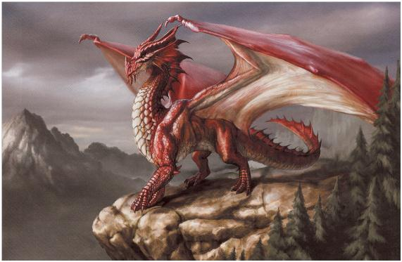
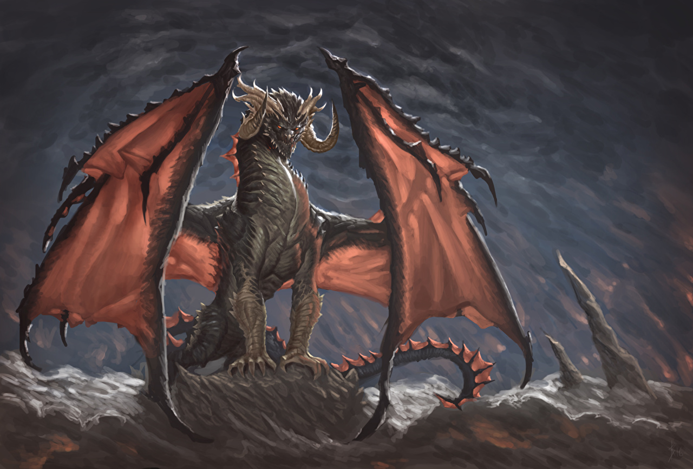
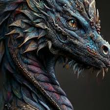

# Dragão

---

## Ficha (D20)

**Raça**: Dragão

**Atributos Raciais**:
- **Modificadores de Atributo**: +2 Força, +1 Constituição
- **Visão no Escuro**: Consegue enxergar no escuro até 36 metros.
- **Resistência Dracônica**: Resistência a um tipo de dano elemental (fogo, gelo, ácido ou eletricidade, dependendo da subespécie).
- **Sopro Elemental**: Uma vez por descanso curto, o Dragão pode usar um sopro elemental causando dano em área (tipo depende da subespécie).

**Habilidades Raciais**:
- **Presença Aterradora**: Pode intimidar criaturas próximas, impondo desvantagem em testes de resistência contra medo.
- **Voo Natural**: Possui a capacidade de voar com velocidade igual à sua movimentação terrestre.

**Nível de Desafio**: Ajustável conforme o cenário ou a campanha, geralmente entre 5 e 15 no sistema D20.

---

## Ficha (3D&T)

**Raça**: Dragão

**Características Raciais**:
- **Vantagens Raciais**:
  - **Poder de Fogo (Elemental)**: Pode lançar um ataque elemental (fogo, gelo, ácido ou eletricidade) uma vez por cena sem custo em Pontos de Magia.
  - **Armadura Extra (Elemental)**: Reduz o dano de ataques do elemento correspondente à subespécie em um nível.
  - **Voo**: Capacidade de voar, ignorando obstáculos terrestres.
- **Desvantagem Racial**:
  - **Orgulho Dracônico**: Deve proteger seu tesouro ou território, evitando recuar de combates em sua área.

**PV (Pontos de Vida)**: Variável conforme o sistema, ajustável pelo Mestre.

---

# Lore

Os Dragões Comuns são criaturas majestosas e temidas, cuja existência remonta aos primórdios do mundo. Nascidos da essência primordial dos elementos, cada dragão está intrinsecamente ligado a um tipo de energia — fogo, gelo, ácido ou eletricidade — que define sua aparência, temperamento e habilidades. Sua presença imponente é suficiente para inspirar temor ou reverência, e suas escamas brilhantes refletem a força de sua herança ancestral.

Apesar de sua natureza poderosa, os Dragões Comuns não são apenas bestas selvagens. São seres inteligentes, muitas vezes dotados de uma sabedoria acumulada ao longo de séculos. Alguns guardam tesouros inestimáveis em cavernas profundas, enquanto outros vagam pelos céus, observando o mundo com olhos que enxergam além do comum. Sua personalidade varia: alguns são protetores, outros são tiranos, mas todos compartilham um orgulho inabalável por sua linhagem.

Os Dragões Comuns possuem traços distintos dependendo de sua subespécie — dragões de fogo exibem tons avermelhados e exalam calor, enquanto dragões de gelo possuem escamas prateadas que refletem a luz como cristais. Apesar de sua força, enfrentam conflitos internos entre seus instintos primordiais e sua inteligência estratégica, o que os torna aliados ou inimigos formidáveis. Cada dragão carrega o peso de sua existência lendária, moldando o destino dos mundos que habitam com suas ações.npm run 