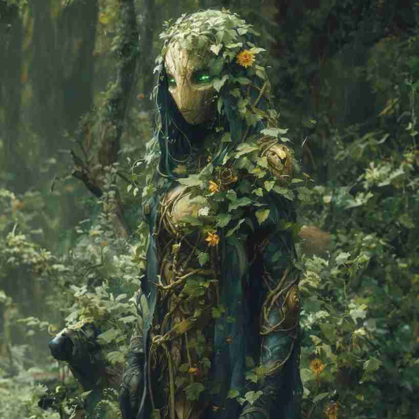

# Meio Ent

---

## Ficha (D20)

- **Tipo**: Monstro Planta
- **Classe de Armadura**: 16 (casca natural)
- **Pontos de Vida**: 60 (8d10 + 16)
- **Deslocamento**: 20 pés

- **Força**: 18 (+4)
- **Destreza**: 8 (-1)
- **Constituição**: 15 (+2)
- **Inteligência**: 10 (+0)
- **Sabedoria**: 13 (+1)
- **Carisma**: 11 (+0)

- **Perícias**: Percepção +3, Natureza +4
- **Vulnerabilidades**: Fogo
- **Sentidos**: Visão no escuro 60 pés, Percepção passiva 13
- **Idiomas**: Silvestre, Comum
- **Desafio**: 3 (700 XP)

### Habilidades

- **Regeneração Natural**: O meio ent regenera 5 pontos de vida por turno enquanto estiver em contato com o solo.
- **Raízes Imobilizadoras**: Pode, uma vez por dia, usar suas raízes para prender uma criatura até 10 pés de distância. A criatura deve realizar um teste de resistência de Força CD 14 ou ficará imobilizada.

---

## Ficha (3D&T)

- **Tipo**: Monstro Planta
- **F**: 3
- **H**: 1
- **R**: 3
- **A**: 2
- **PdF**: 0

### Vantagens

- **Regeneração**: Recupera 1 ponto de vida a cada turno enquanto estiver em contato com o solo.
- **Força da Natureza**: O meio ent recebe um bônus de +1 em Força para testes que envolvam levantamento de peso, ataques físicos e resistência.

### Desvantagens

- **Vulnerabilidade ao Fogo**: Sofre dano dobrado contra ataques de fogo.
- **Lento**: Devido ao seu corpo pesado e estrutura rígida, o meio ent tem um deslocamento reduzido e sofre uma penalidade em testes de agilidade.

---

## Lore

Os meio ents são criaturas misteriosas, uma fusão entre humanoides e árvores antigas. Originários de florestas profundas, são conhecidos como protetores das árvores e do solo, possuindo uma ligação espiritual com a terra. Embora não tão grandes quanto seus parentes ents completos, eles possuem uma força extraordinária e uma resistência quase inabalável.

Sua aparência é robusta, com uma pele que se assemelha a casca de árvore, ramos brotando de seus membros e musgo cobrindo parte de seu corpo. Eles se movem lentamente, mas com uma força que é capaz de quebrar pedras. Meio ents preferem evitar o conflito, mas, quando ameaçados, podem se tornar combatentes ferozes.

Essas criaturas raramente interagem com outras raças, preferindo a companhia de árvores e plantas. Em algumas lendas, é dito que meio ents são o resultado de um ritual antigo em que humanos, buscando sabedoria e proteção, se fundiram com a floresta. Exploradores que cruzam o território dos meio ents muitas vezes encontram marcas de árvores esculpidas como advertência para não perturbar o silêncio e a paz de suas florestas. 
