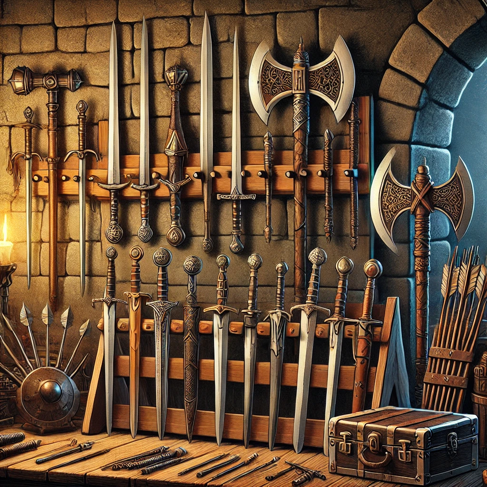
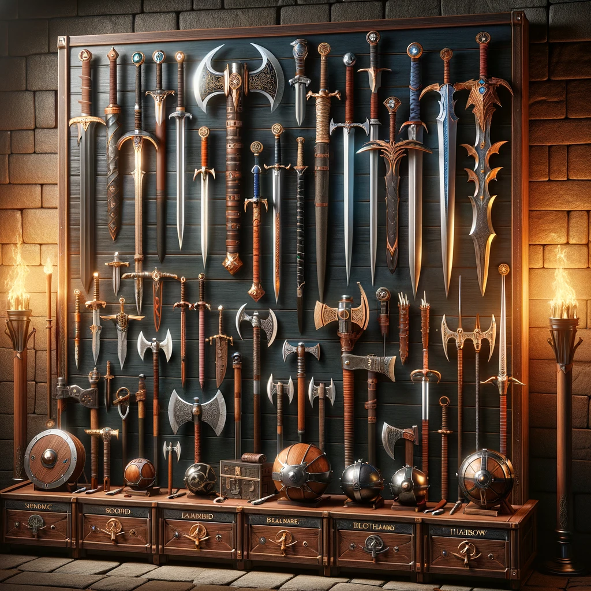

# Guia de Armas 
  
  

---

## Ficha (D20)

### Corpo-a-Corpo

| Nome                  | Dano         | Tipo de Dano        | Mãos | Peso (kg) | Preço (po) |
|-----------------------|--------------|---------------------|------|-----------|------------|
| Adaga                 | 1d4          | Perfuração          | 1    | 0,5       | 2          |
| Espada Curta          | 1d6          | Corte               | 1    | 1         | 10         |
| Espada Longa          | 1d8          | Corte               | 1/2  | 2         | 15         |
| Lança                 | 1d6          | Perfuração          | 1/2  | 3         | 5          |
| Maça                  | 1d6          | Contusão            | 1    | 2         | 5          |
| Machado de Combate    | 1d8          | Corte               | 1/2  | 3         | 10         |
| Sabre                 | 1d8          | Corte/Perfuração    | 1    | 1,5       | 25         |
| Martelo de Guerra     | 1d10         | Contusão            | 2    | 5         | 15         |
| Foice de Guerra       | 2d4          | Corte               | 2    | 4         | 18         |
| Porrete               | 1d6          | Contusão            | 1    | 2         | 1          |
| Espada Bastarda       | 1d10         | Corte               | 1/2  | 3         | 35         |
| Falcione              | 2d4          | Corte               | 2    | 4         | 50         |
| Glaive                | 1d10         | Corte               | 2    | 3         | 8          |
| Halberd               | 1d10         | Corte/Perfuração    | 2    | 6         | 20         |
| Mangual               | 1d8          | Contusão            | 2    | 4         | 12         |
| Espada Curvada        | 1d8          | Corte               | 1    | 2         | 18         |
| Katana                | 1d10         | Corte               | 2    | 3         | 50         |
| Naginata              | 1d10         | Corte               | 2    | 5         | 20         |
| Chakram               | 1d6          | Corte               | 1    | 0,5       | 15         |
| Espada Larga          | 1d12         | Corte               | 2    | 4         | 50         |
| Espada Grande         | 2d6          | Corte               | 2    | 6         | 50         |
| Maça Estrela          | 1d8          | Contusão            | 2    | 4         | 15         |
| Lança de Guerra       | 1d10         | Perfuração          | 2    | 4         | 15         |
| Picareta de Guerra    | 1d8          | Perfuração          | 1    | 3         | 8          |
| Tridente              | 1d8          | Perfuração          | 2    | 4         | 5          |
| Machadinha            | 1d6          | Corte               | 1    | 1         | 6          |
| Machado de Guerra     | 1d12         | Corte               | 2    | 4         | 15         |
| Foice Agrícola        | 1d4          | Corte               | 1    | 2         | 1          |
| Corrente com Lâmina   | 1d10         | Corte/Contusão      | 2    | 3         | 25         |

### Distância

| Nome                  | Dano         | Tipo de Dano        | Alcance (m) | Peso (kg) | Preço (po) |
|-----------------------|--------------|---------------------|-------------|-----------|------------|
| Arco Curto            | 1d6          | Perfuração          | 24          | 1         | 30         |
| Arco Longo            | 1d8          | Perfuração          | 45          | 2         | 75         |
| Arco Composto         | 1d8          | Perfuração          | 45          | 3         | 100        |
| Besta Leve            | 1d8          | Perfuração          | 24          | 2         | 35         |
| Besta Pesada          | 1d10         | Perfuração          | 30          | 5         | 50         |
| Lança de Arremesso    | 1d6          | Perfuração          | 9           | 2         | 1          |
| Shuriken              | 1            | Perfuração          | 6           | 0,5       | 10         |
| Dardo                 | 1d4          | Perfuração          | 6           | 0,5       | 2          |
| Chakram               | 1d6          | Corte               | 9           | 1         | 5          |
| Azagaia               | 1d6          | Perfuração          | 9           | 2         | 8          |
| Rede                  | Especial     | Nenhum              | 3           | 3         | 20         |
| Arpão                 | 1d8          | Perfuração          | 9           | 4         | 15         |
| Boleadeira            | 1d4          | Contusão            | 6           | 2         | 5          |
| Pedra de Funda        | 1d4          | Contusão            | 9           | 0,5       | 1          |
| Funda                 | 1d4          | Contusão            | 12          | 1         | 3          |
| Cajado de Arremesso   | 1d8          | Contusão            | 15          | 3         | 10         |
| Flecha de Fogo        | 1d8+1        | Perfuração/Fogo     | 18          | 1         | 25         |
| Flecha Envenenada     | 1d6 + Veneno | Perfuração/Veneno   | 18          | 1         | 30         |

---

## Ficha (3D&T)

### Corpo-a-Corpo

| Nome                  | Efeito       | Tipo de Dano        | Mãos | Preço (moedas) |
|-----------------------|--------------|---------------------|------|----------------|
| Adaga                 | +3           | Perfuração          | 1    | 80             |
| Espada Curta          | +1           | Corte               | 1    | 20             |
| Espada Longa          | +2           | Corte               | 1/2  | 50             |
| Lança                 | +1d-1        | Perfuração          | 1/2  | 300            |
| Maça                  | +3           | Contusão            | 1    | 80             |
| Machado de Combate    | +3           | Corte               | 1/2  | 40             |
| Sabre                 | +1d          | Corte/Perfuração    | 1    | 400            |
| Martelo de Guerra     | +2d+2        | Contusão            | 2    | 1000           |
| Foice de Guerra       | +3           | Corte               | 1/2  | 300            |
| Porrete               | +1d+2        | Contusão            | 1    | 500            |
| Espada Bastarda       | +3           | Corte               | 1/2  | 70             |
| Falcione              | +2d          | Corte               | 2    | 850            |
| Glaive                | +1d+1        | Corte               | 2    | 700            |
| Halberd               | +1d+1        | Corte/Perfuração    | 2    | 750            |
| Mangual               | +1d+1        | Contusão            | 2    | 600            |
| Espada Curvada        | +1d          | Corte               | 1    | 350            |
| Katana                | +2           | Corte               | 2    | 450            |
| Naginata              | +2           | Corte               | 2    | 500            |
| Chakram               | +1d-1        | Corte               | 1    | 300            |
| Espada Larga          | +2d+1        | Corte               | 2    | 900            |
| Espada Grande         | +2d+2        | Corte               | 2    | 1000           |
| Maça Estrela          | +1d+1        | Contusão            | 2    | 500            |
| Lança de Guerra       | +1d+1        | Perfuração          | 2    | 400            |
| Picareta de Guerra    | +4           | Perfuração          | 2    | 120            |
| Tridente              | +2           | Perfuração          | 2    | 200            |
| Machadinha            | +1           | Corte               | 1    | 60             |
| Machado de Guerra     | +2d+1        | Corte               | 2    | 850            |
| Foice Agrícola        | +1           | Corte               | 1    | 50             |
| Corrente com Lâmina   | +1d+1        | Corte/Contusão      | 2    | 600            |

### Distância

| Nome                  | Efeito       | Tipo de Dano        | Alcance (m) | Preço (moedas) |
|-----------------------|--------------|---------------------|-------------|----------------|
| Arco Curto            | +2           | Perfuração          | 15          | 100            |
| Arco Longo            | +4           | Perfuração          | 19          | 250            |
| Arco Composto         | +4           | Perfuração          | 19          | 300            |
| Besta Leve            | +1d          | Perfuração          | 15          | 200            |
| Besta Pesada          | +1d+3        | Perfuração          | 25          | 260            |
| Lança de Arremesso    | +1           | Perfuração          | 9           | 10             |
| Shuriken              | +1           | Perfuração          | Força x 4m  | 10             |
| Dardo                 | +1           | Perfuração          | 6           | 10             |
| Chakram               | +1d-1        | Corte               | 9           | 50             |
| Azagaia               | +2           | Perfuração          | 9           | 80             |
| Rede                  | Especial     | Nenhum              | 3           | 20             |
| Arpão                 | +1d          | Perfuração          | 9           | 150            |
| Boleadeira            | +1           | Contusão            | 6           | 50             |
| Pedra de Funda        | +1           | Contusão            | 9           | 10             |
| Funda                 | +1           | Contusão            | 12          | 30             |
| Cajado de Arremesso   | +1d+1        | Contusão            | 15          | 400            |
| Flecha de Fogo        | +1d+2        | Perfuração/Fogo     | 18          | 500            |
| Flecha Envenenada     | +1d+Veneno   | Perfuração/Veneno   | 18          | 600            |

---

# Lore  

Armas são uma extensão da identidade do guerreiro e sua cultura. Cada tipo reflete uma função específica e simboliza valores como força, precisão e honra. 

- **Corte:** Espadas e machados causam cortes profundos. 
- **Perfuração:** Lanças e bestas perfuram defesas inimigas.
- **Contusão:** Maças e martelos destroem com impacto.

Na fantasia, as armas transcendem a utilidade, tornando-se símbolos heroicos e lendas.
