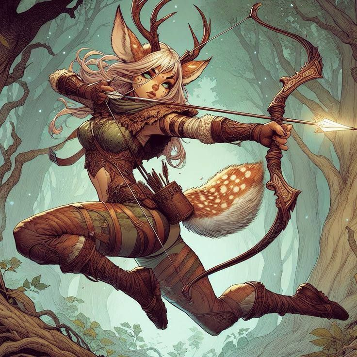

# Fauno(a)

---

## Ficha (D20)

- **Tipo**: Monstro Florestal
- **Classe de Armadura**: 14 (pele natural)
- **Pontos de Vida**: 45 (7d8 + 14)
- **Deslocamento**: 30 pés

- **Força**: 13 (+1)
- **Destreza**: 15 (+2)
- **Constituição**: 12 (+1)
- **Inteligência**: 10 (+0)
- **Sabedoria**: 14 (+2)
- **Carisma**: 16 (+3)

- **Perícias**: Furtividade +5, Percepção +4
- **Resistências**: Encantamento
- **Sentidos**: Visão no escuro 60 pés, Percepção passiva 14
- **Idiomas**: Silvestre, Comum
- **Desafio**: 2 (450 XP)

### Habilidades

- **Toque da Natureza**: Uma vez por dia, o fauno pode usar magia para restaurar a vegetação ao seu redor, curando 10 pontos de vida de criaturas próximas.
- **Canção Encantadora**: O fauno pode cantar uma melodia que afeta todas as criaturas a até 30 pés. As criaturas devem realizar um teste de resistência de Sabedoria CD 13 ou ficarão encantadas enquanto ouvirem o canto.

---

## Ficha (3D&T)

- **Tipo**: Monstro Florestal
- **F**: 2
- **H**: 4
- **R**: 2
- **A**: 1
- **PdF**: 0

### Vantagens

- **Encanto da Floresta**: Pode realizar um teste de Habilidade para tentar encantar uma criatura próxima. Em caso de sucesso, a criatura se torna temporariamente aliada do fauno.
- **Ligação com a Natureza**: O fauno é imune a encantos e pode se mover sem deixar rastros em ambientes florestais.

### Desvantagens

- **Vulnerabilidade ao Fogo**: Sofre dano adicional contra ataques de fogo.
- **Curiosidade**: O fauno é facilmente distraído por fenômenos naturais ou sons estranhos, podendo ser enganado ou atraído para armadilhas.

---

## Lore

Os faunos são criaturas místicas das florestas, conhecidos por sua ligação profunda com a natureza e por seus encantamentos. Vivem em clareiras escondidas e bosques antigos, onde se dedicam a proteger o equilíbrio natural e auxiliar aqueles que respeitam seu ambiente. São mestres da música e usam suas melodias encantadoras para comunicar-se com a fauna e flora locais.

Essas criaturas possuem uma personalidade alegre e despreocupada, mas podem se tornar ferozes defensores da floresta contra ameaças externas. Sua aparência é uma mistura de humano com traços de cabra, com chifres, patas e uma pelagem leve. Eles são frequentemente avistados dançando à luz da lua, celebrando a vida selvagem em rituais mágicos.

A lenda dos faunos fala de uma ordem ancestral de protetores da natureza, que se comunicam diretamente com o espírito da floresta. Exploradores que se aventuram em suas terras contam histórias de encontros enigmáticos, onde os faunos ajudam ou atrapalham, dependendo de sua atitude em relação ao ambiente natural.
