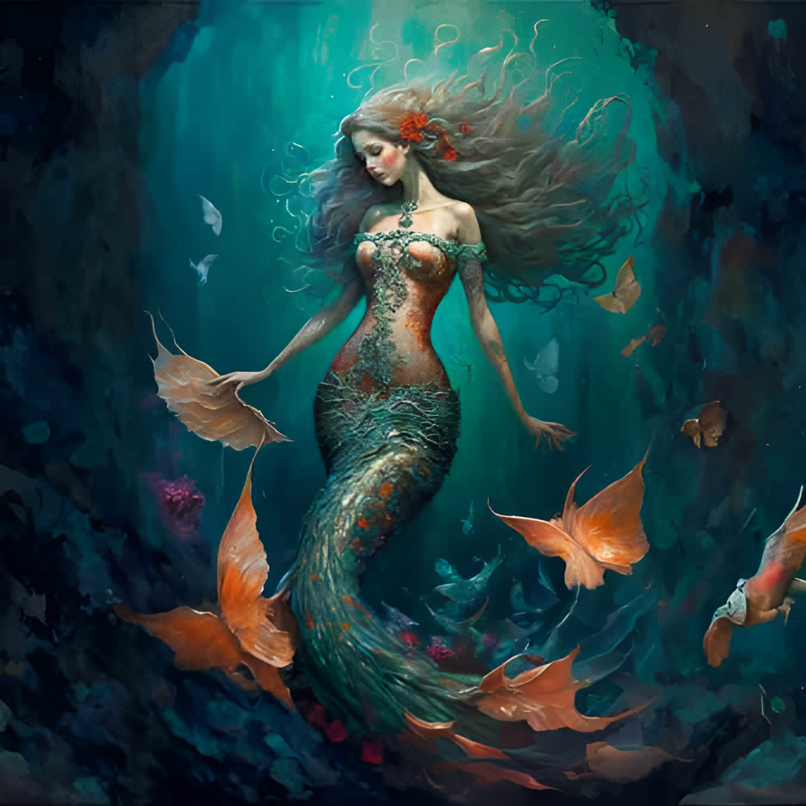

# Sereia

---

## Ficha (D20)

- **Tipo**: Monstro Aquático
- **Classe de Armadura**: 15 (escamas naturais)
- **Pontos de Vida**: 52 (8d8 + 16)
- **Deslocamento**: 10 pés, nado 40 pés

- **Força**: 14 (+2)
- **Destreza**: 16 (+3)
- **Constituição**: 14 (+2)
- **Inteligência**: 12 (+1)
- **Sabedoria**: 13 (+1)
- **Carisma**: 18 (+4)

- **Perícias**: Enganação +6, Percepção +4
- **Imunidades**: Encantamento
- **Sentidos**: Visão no escuro 60 pés, Percepção passiva 14
- **Idiomas**: Aquan, Comum
- **Desafio**: 3 (700 XP)

### Habilidades

- **Encanto das Profundezas**: Uma vez por dia, a sereia pode encantar uma criatura que possa vê-la e ouvir sua voz. A criatura deve realizar um teste de resistência de Sabedoria CD 14 ou ficará encantada por 1 minuto.
- **Canto Hipnótico**: A sereia canta uma melodia hipnótica que afeta todas as criaturas a até 30 pés dela. As criaturas devem realizar um teste de resistência de Sabedoria CD 13 ou ficarão atordoadas enquanto ouvirem o canto.

---

## Ficha (3D&T)

- **Tipo**: Monstro Aquático
- **F**: 1
- **H**: 3
- **R**: 2
- **A**: 2
- **PdF**: 0

### Vantagens

- **Canto Encantador**: Pode realizar um teste de Habilidade para tentar encantar uma criatura próxima. Em caso de sucesso, a criatura se torna temporariamente aliada da sereia.
- **Forma Aquática**: A sereia é uma criatura adaptada ao ambiente aquático, sendo capaz de nadar rapidamente e respirar debaixo d'água.

### Desvantagens

- **Fraqueza ao Fogo**: A sereia sofre dano adicional contra ataques de fogo.
- **Dependência de Água**: Deve retornar à água regularmente ou perderá 1 PV por turno fora dela.

---

## Lore

As sereias são criaturas míticas das profundezas, conhecidas por sua beleza encantadora e pelo canto hipnótico que atrai marinheiros desprevenidos. Vivem em regiões costeiras e recifes escondidos, onde usam sua voz mágica para confundir e atrair suas presas. Muitas histórias sobre sereias falam de sua capacidade de mudar de forma e se adaptar tanto em águas salgadas quanto em águas doces.

Essas criaturas têm uma personalidade curiosa e, às vezes, brincalhona. São conhecidas por observar humanos à distância, raramente interagindo, mas podem se tornar perigosas caso se sintam ameaçadas ou se estejam protegendo seu território. Sua aparência varia de acordo com a região, mas todas compartilham traços aquáticos, como escamas brilhantes, olhos profundos e uma graça etérea que parece sobrenatural.

A lenda das sereias fala de um reino submerso onde habitam em grandes grupos, formando sociedades complexas e secretas. Exploradores que alegam ter visto sereias retornam com relatos variados: alguns falam de encontros pacíficos, enquanto outros descrevem momentos assustadores e de pura sorte ao sobreviver ao seu encantador, porém perigoso, chamado.
