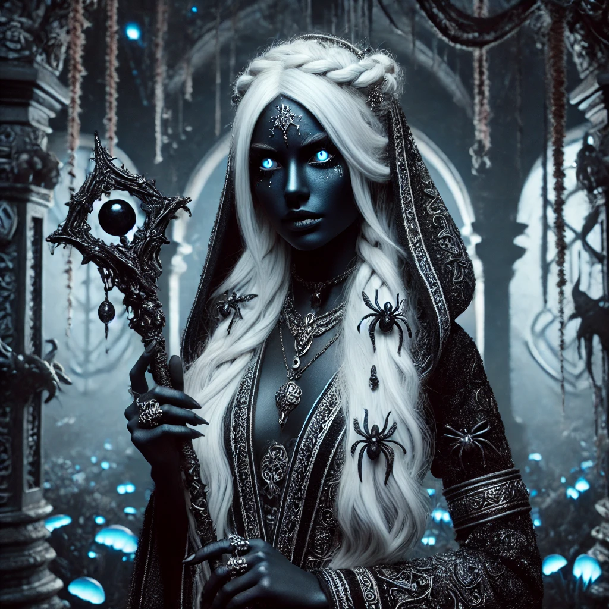

# Drow

---

## Ficha (3D&T)

**Raça**: Drow (Elfo Negro)

**Características Raciais**:
- **Vantagens Raciais**:
  - **Visão na Penumbra**: Os Drows conseguem enxergar perfeitamente em áreas com pouca luz, mas precisam fazer um teste para resistir a luzes fortes.
  - **Resistência a Magia**: Possuem resistência a magia, diminuindo o dano de feitiços em um nível.
  - **Conjurador Nato**: Podem lançar algumas magias, como *Globo de Escuridão* e *Luz*, uma vez por dia sem custo em Pontos de Magia.
- **Desvantagem Racial**:
  - **Vulnerabilidade à Luz Solar**: Recebem uma penalidade em testes feitos sob luz solar direta.

**PV (Pontos de Vida)**: Ajustável conforme o nível, definido pelo Mestre

---

## Ficha (D20)

**Raça**: Drow

**Atributos Raciais**:
- **Modificadores de Atributo**: +2 Destreza, +1 Carisma
- **Visão no Escuro Superior**: Consegue enxergar no escuro até 36 metros, mas sofre desvantagem em ambientes com luz forte.
- **Resistência Mágica**: Vantagem em testes de resistência contra magias.
- **Magia Inata**: O Drow pode lançar a magia *Globo de Escuridão* e *Dança das Luzes* uma vez por dia.

**Habilidades Raciais**:
- **Furtividade Silenciosa**: Os Drows recebem um bônus em testes de furtividade em ambientes escuros ou sombrios.
- **Maestria com Armas Élficas**: Treinados com espadas curtas, bestas de mão e bestas leves.

**Nível de Desafio**: Ajustável conforme a aventura ou combate, a critério do Mestre.

---

## Lore

Os Drows, conhecidos como Elfos Negros, são descendentes das casas élficas que, há séculos, foram banidas para o submundo após serem acusadas de traição e praticarem magia proibida. Vivendo nas profundezas da terra, em cavernas iluminadas por fungos bioluminescentes, os Drows se adaptaram à escuridão, desenvolvendo visão aprimorada e resistência a magias. Conhecidos por sua astúcia e habilidades em combate, eles vivem em sociedades matriarcais, onde a política e a traição são comuns e respeitadas.

A sociedade Drow é rígida e repleta de intrigas, dominada por sacerdotisas devotas a divindades sombrias, especialmente Lolth, a Deusa-Aranha, cuja palavra é lei entre os clãs. Criados para serem letais e silenciosos, os Drows raramente saem de seus domínios subterrâneos, mas quando o fazem, sua presença é tanto admirada quanto temida. Embora muitos Drows sejam moldados pela cultura sombria de sua sociedade, alguns desafiam seus destinos e buscam redenção, enfrentando os preconceitos de ambos os mundos — o subterrâneo e o da superfície.
